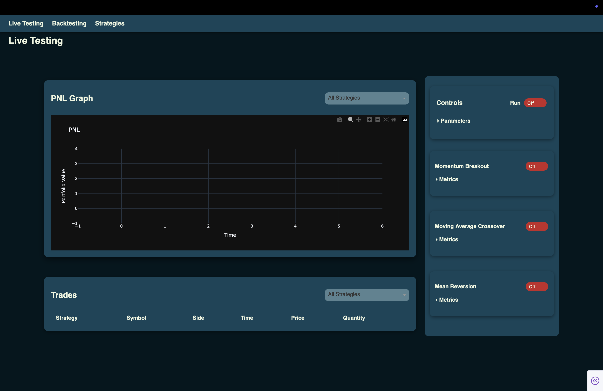
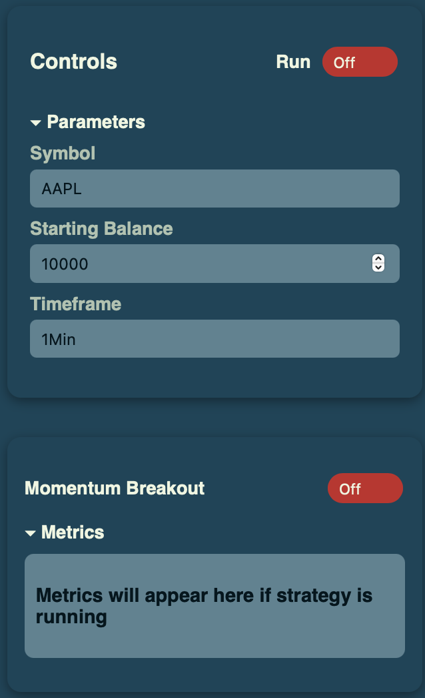
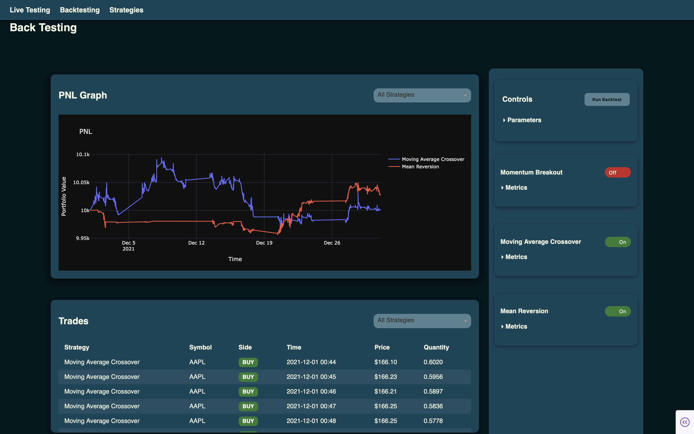
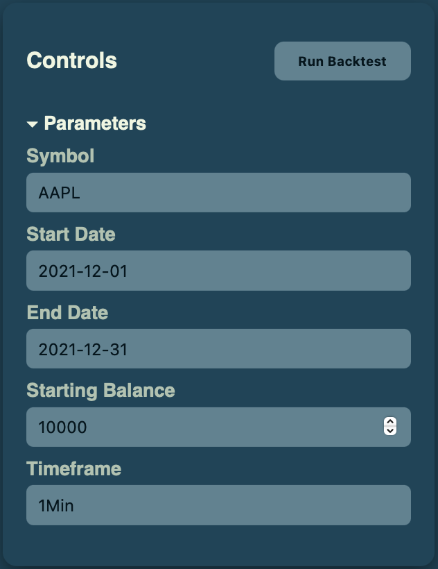
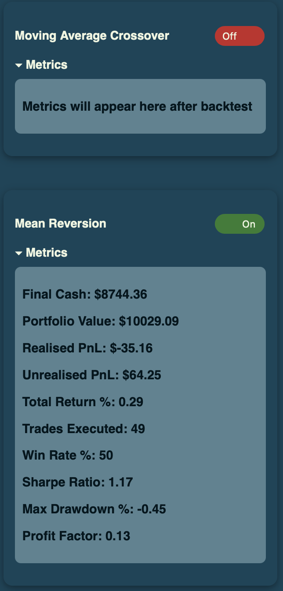
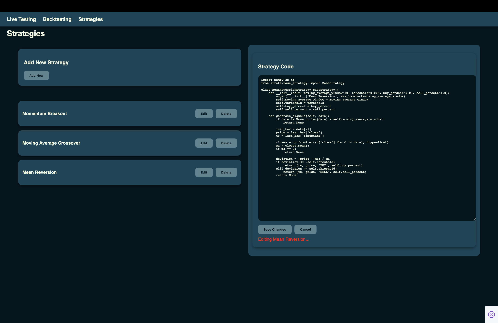

# Game of Loans

An algorithmic trading dashboard that lets you design, backtest, and live-test trading strategies.

## Features
- Web-Based dashboard built with Dash, providing an interactive interface for strategy management, performance monitoring, and visual analytics.
- Custom strategy framework with modular design allowing users to implement, register, and modify trading strategies.
### Backtesting Engine
- Supports configurable instruments, timeframes, and date ranges.
- Parallel execution of multiple strategies for performance benchmarking.
- Generates detailed reports including equity curve, drawdowns, trade logs, and risk-adjusted metrics.
### Live Testing
- Connects to real-time data feeds.
- Runs strategies in a simulated brokerage.
- Streams execution metrics and updates continuously.

## Installation

```bash
git clone https://github.com/TheVarunAGupta/Game-of-Loans.git
cd Game-of-Loans
pip install -r requirements.txt
```
Configure environment variables. 

```python
APCA_API_KEY_ID=your-api-key
APCA_API_SECRET_KEY=your-secret-key
APCA_API_BASE_URL=https://paper-api.alpaca.markets
```

Run the app. 
```bash
python app.py
```

## Visuals

### Live-testing dashboard


### Live-testing controls panel


### Backtesting dashboard


### Backtesting controls panel


### Backtesting metrics panel


### Strategies dashboard



